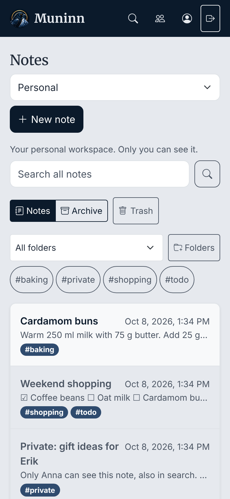
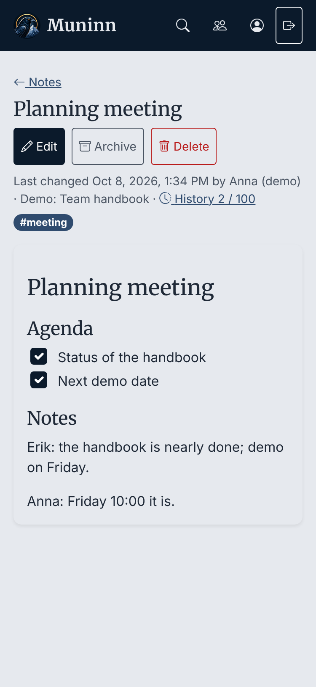
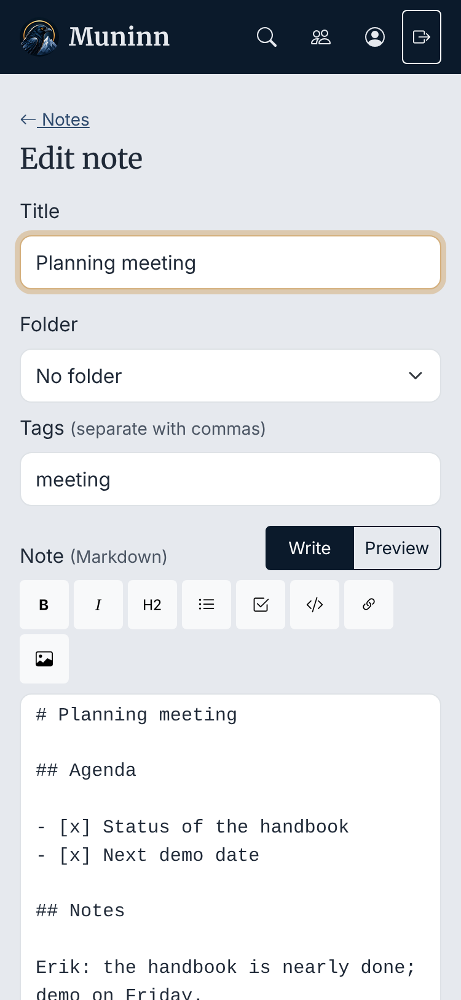
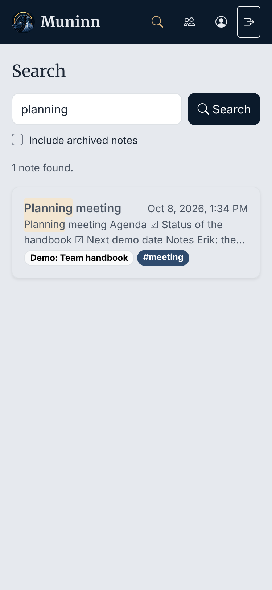
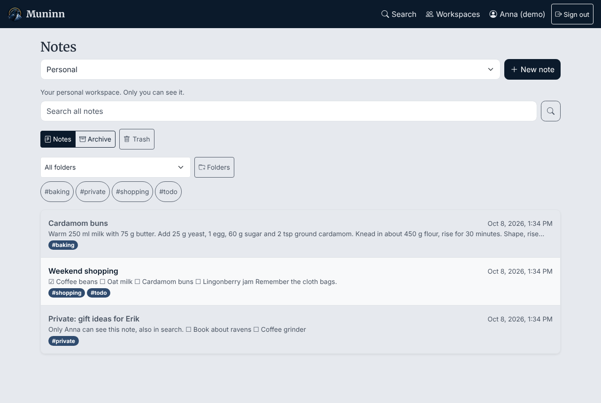
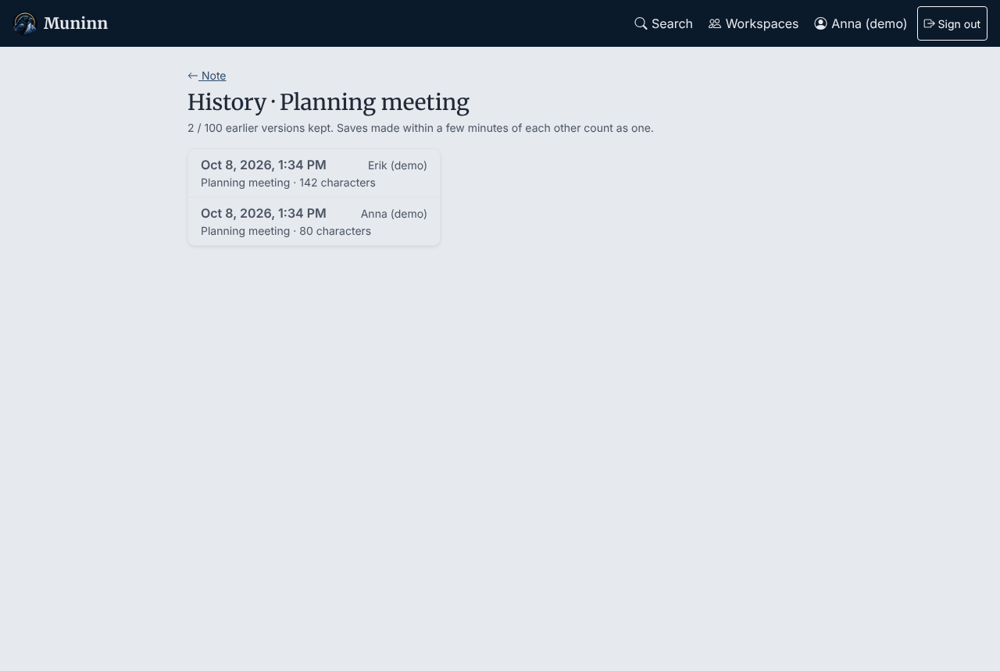

# Demo path

A walk-through of about ten minutes that shows every part of the Course MVP, from sign-in to a
shared workspace. It works on the live site (`https://www.dx.se/muninn/`) or a local setup.

## Before the demo

1. Create the demo data once, on the NAS from `/volume1/Muninn`:
   ```sh
   sudo php84 bin/seed-demo.php
   ```
   It prints two accounts with random passwords, **shown only this once**:
   `demo.anna` (Owner of the shared workspace) and `demo.erik` (Editor there). Write them down.
   Lost them? Create a reset link for the account on the admin Users page.
2. Open two browser windows: a normal one for Anna and a private one for Erik. On a phone,
   use the installed app for Anna.
3. Have the admin account's password at hand for step 7.

What the script creates:

| Where | Notes |
|---|---|
| Anna's personal workspace | "Weekend shopping" (checklist), "Cardamom buns" (folder *Recipes*), "Private: gift ideas for Erik", and "Summer trip 2025" in the Archive |
| Erik's personal workspace | "Running log" (a Markdown table) |
| Shared "Demo: Team handbook" | "Welcome to the team handbook" (links), "Deploying a new release" (code block, folder *Routines*), "Planning meeting" (edited by both, so it has history) |

## The walk-through

1. **Sign in** as Anna. The notes page shows her personal workspace; the previews show readable
   text with ☐/☑ for checklists, not raw Markdown.
2. **Create a note**: *New note*, title "Demo", write a heading, a checklist (toolbar button), a
   code block and a link. Paste a screenshot from the clipboard (or pick an image). *Preview*,
   then *Save*. Tick a checklist box in the read view.
3. **Organise**: give it the tag `demo` and the folder *Recipes*; filter the list by the tag and
   the folder.
4. **Search**: search for `cardamom`, then `canoe` (nothing), then `canoe` with *Include archived
   notes* (the archived trip shows up).
5. **History**: switch to *Demo: Team handbook*, open "Planning meeting" and its *History 2 / 100*.
   Open Erik's version and restore it; the restore is itself a new version.
6. **Shared workspace and isolation**: in Erik's window, open the same note; he sees Anna's change.
   Search for `gift` as Erik: no results, because that note is in Anna's personal workspace.
   On *Workspaces*, Anna is Owner and can change Erik to Reader; Erik's *Edit* button then
   disappears, and the API refuses edits from him (403).
7. **Lifecycle**: delete the "Demo" note, find it in *Trash*, restore it. Trash keeps notes for
   30 days before they are deleted for good.
8. **Administration**: sign in as the admin (a separate account without notes, D025). *Users*
   lists the accounts; *Invitations* creates a one-time invitation link; *Workspaces* lists
   shared workspaces with their Owners but never their notes.
9. **Install**: on the phone, *Add to Home Screen*; Muninn opens full screen with the raven icon.

## After the demo

Disable `demo.anna` and `demo.erik` on the admin Users page. They can no longer sign in, and
their notes are unreachable. On a test server, `sudo php84 bin/reset-data.php` clears everything
except the admin accounts instead.

## Screenshots

From a local run with the demo data (`docs/screenshots/`):

| | |
|---|---|
|  |  |
|  |  |



